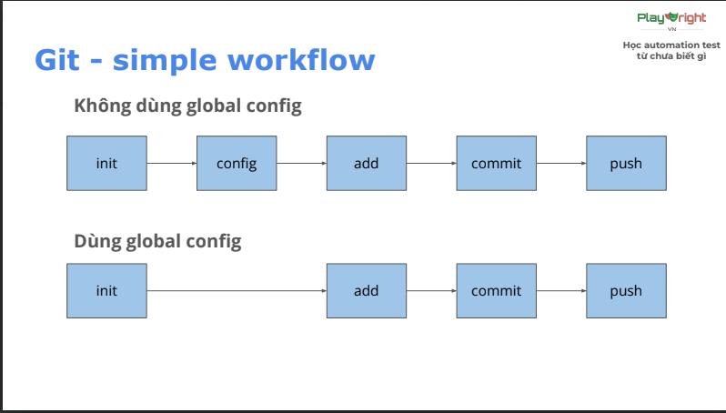

# Lesson2: Git & Javascript basic
## Version control system 
-  Local: lưu ở máy cá nhân
- Centralize: lưu ở một máy
chủ tập trung.
- Distributed: lưu ở nhiều
máy khác nhau
## Git & Github
| Git | GitHub|
|-----|-------|
|Là một phần mềm| Là một dịch vụ web|
|Cài trên máy của bạn |Host trên website|
|Là một command line tool |Là công cụ có giao diện|
|Là công cụ quản lý phiên bản, đưa file vào Git repository|Là nơi để upload Git repository lên|
|Có các tính năng của Version Control System |Có các tính năng của Version Control System và một số tính năng khác(GitHub Actions, GitHubCo-pilot)|
## Git - three states
| Zone |Mô tả| Lệnh chuyển tiếp |
|------|------------------|---------|
|Working Directory |Thư mục làm việc (local)| git add -> Staging Area |
| Staging Area | Vùng chờ - chứa các thay đổi, sẵn sàng commit  | git commit -> Repository|
|Repository | Kho lưu trữ - lịch sử commit
## Git- commit convention
- dùng convention sau: 'type: short_description'
    - chore: sửa nhỏ lẻ,chính tả, xóa file không dùng tới,...
    - feat: thêm tính năng mới, test case mới
    - fix: sửa lỗi 1 test trước đó
-  short_description: mô tả ngắn gọn (50 kí tự)
## Git - simple workflow
